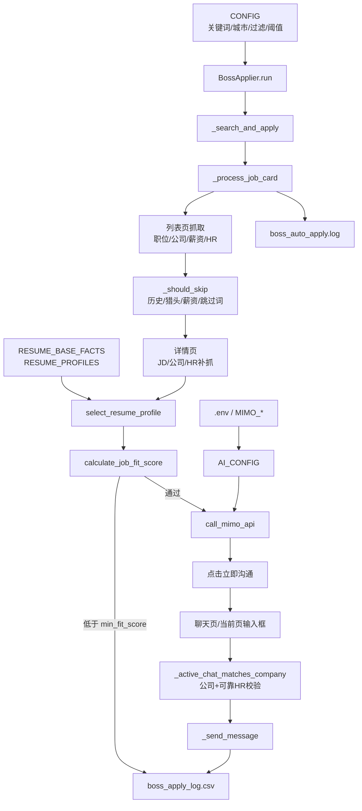
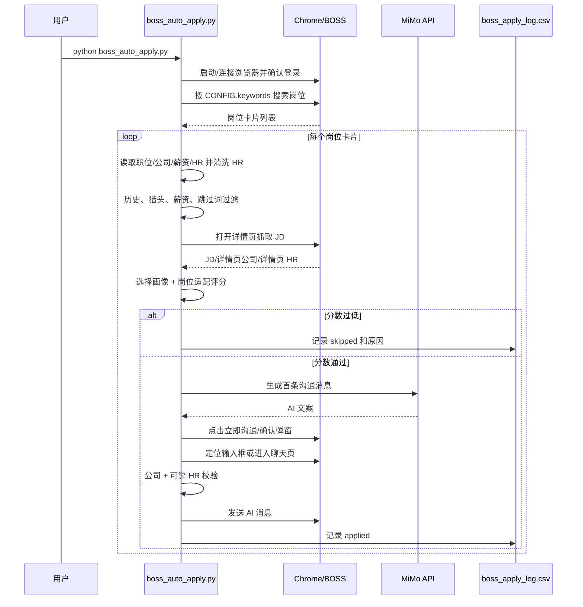

# BOSS 自动投递脚本信息图谱

本文档对应 `boss_auto_apply.py`，用于快速理解脚本结构、执行链路、优化开关，以及把当前“计算机专业求职者”改成其他使用对象时应该改哪里。

## 脚本总览

| 模块 | 位置 | 作用 |
| --- | --- | --- |
| 环境变量 | `_load_env()`、`.env` | 读取 MiMo API Key、模型、base URL、AI 开关 |
| 投递配置 | `CONFIG` | 搜索词、城市、投递上限、跳过词、薪资、岗位适配阈值、聊天校验策略 |
| 画像配置 | `RESUME_BASE_FACTS`、`RESUME_PROFILES`、`PROFILE_PRIORITY` | 定义候选人事实、岗位方向、关键词、证明点、禁用话术 |
| 岗位搜索 | `_search_and_apply()` | 按关键词和城市打开 BOSS 搜索页、滚动、逐个处理岗位卡片 |
| 岗位筛选 | `_should_skip()`、`calculate_job_fit_score()` | 历史去重、猎头/外包/薪资过滤、岗位适配评分 |
| 画像匹配 | `select_resume_profile()` | 根据搜索词、职位名和 JD 选择最合适画像 |
| AI 生成 | `call_mimo_api()` | 用画像事实和 JD 生成首条沟通消息 |
| 投递/聊天 | `_process_job_card()`、`_try_send_in_current_tab()`、`_goto_chat_and_send()` | 点击沟通按钮、确认弹窗、找到聊天输入框、发送消息 |
| 安全校验 | `_active_chat_matches_company()`、`_click_first_contact()` | 公司和招聘人校验，防止发错联系人 |
| 持久化 | `boss_apply_log.csv`、`boss_auto_apply.log` | CSV 记录投递结果，日志记录过程和故障 |

## 模块关系图

## 执行时序图

## 关键配置入口

| 配置 | 建议怎么改 | 影响 |
| --- | --- | --- |
| `keywords` | 写目标岗位搜索词，短词覆盖广，长词更精准 | 影响岗位来源 |
| `city` | 写目标城市，如 `深圳`、`广州` | 影响搜索地区 |
| `max_apply_per_keyword` | 每个关键词最多投几条 | 控制单词投递量 |
| `max_apply_per_day` | 每天最多投几条 | 控制总投递量 |
| `skip_keywords` | 写必须排除的岗位词 | 降低错投 |
| `require_keywords` | 为空表示不限制；填写后职位名必须命中 | 显著提高精准度但减少数量 |
| `max_salary_k` | 薪资上限，`0` 表示关闭 | 当前用于过滤过高薪资岗 |
| `min_fit_score` | 岗位适配最低分，`0` 表示关闭 | 越高越精准，越低投递更多 |
| `allow_company_only_when_hr_unreliable` | `True` 时 HR 不可靠但公司命中可发送 | 影响聊天页发送安全/成功率 |
| `chat_contact_scan_limit` | fallback 最多扫描几个联系人 | 越高越慢，但找到目标概率更高 |

## 如何更换使用对象

### 1. 先改基础事实

修改 `RESUME_BASE_FACTS`：

- `summary`：专业、届别、目标城市、目标方向、最核心经历。
- `core_stack`：候选人的主要技能，不要写不会的。
- `communication_rules`：哪些信息不能说，哪些身份要弱化或强调。

### 2. 再改搜索与过滤

修改 `CONFIG`：

- 设计类（当前配置）：`keywords` 已改为 `["UI设计", "UX设计", "交互设计", "视觉设计", "品牌设计", "平面设计", "信息可视化", "电商设计", "美工", "平面设计师"]`，`skip_keywords` 覆盖销售/运营/开发/硬件/机械等非设计方向，`max_salary_k` 设为 12。
- 运营类：`keywords` 可改为 `["新媒体运营", "内容运营", "用户运营"]`，画像里要写平台、数据、内容案例。
- 财务类：`keywords` 可改为 `["会计", "财务助理", "出纳", "审计助理"]`，过滤掉销售、催收、保险。
- 机械类：`keywords` 可改为 `["机械设计", "结构工程师", "机械工程师"]`，当前脚本的硬件/机械跳过词要移除或改写。

### 3. 重写画像

每个 `RESUME_PROFILES` 条目建议保留这些字段：

- `match_keywords`：大方向词，例如 `ui/ux/交互设计`。
- `specific_keywords`：强匹配词，例如 `原型/高保真/低保真`。
- `preferred_keywords`：高质量岗位词，用于适配分加分。
- `negative_keywords`：该画像不该投的岗位词，用于扣分。
- `target_job`：画像目标岗位。
- `skills`：真实技能。
- `campus_pitch` / `experienced_pitch`：校招和社招表达口径。
- `proof_points`：真实证据，AI 只能从这里取材料。
- `avoid_claims`：禁止夸大的内容。

当前已配置 5 个设计画像（+ default 兜底）：

| 画像键名 | 目标岗位 | 核心作品证据 |
| --- | --- | --- |
| `ui_ux` | UI/UX设计师 | 「余光」APP毕设（情绪日记/冥想呼吸/匿名漂流瓶/共鸣社区/IP形象「甜脆」） |
| `brand_visual` | 品牌设计/视觉设计 | 「甜序」奶茶品牌VIS（命名/logo/色彩字体/菜单包装/手提袋/门头/海报） |
| `info_visualization` | 信息可视化/数据设计 | 全球文化迁徙史桑基图、IKEA毕利书柜拆解图、海洋的泪环保科普图 |
| `ecommerce_design` | 电商/运营设计 | RNW护发精油详情页、百雀羚保湿乳详情页、产品摄影 |
| `general_visual` | 综合视觉/平面设计 | 综合引用APP/VI/信息图/详情页/书装/CD封面/摄影 |
| `default` | 视觉传达设计（兜底） | 综合引用所有作品 |

### 4. 调整画像优先级

修改 `PROFILE_PRIORITY`。多个画像都命中时，靠前的画像更容易胜出。

当前优先级：`["ui_ux", "brand_visual", "info_visualization", "ecommerce_design", "general_visual"]`。

例：如果候选人主攻品牌设计，把 `brand_visual` 放到 `ui_ux` 前面。

## 常见问题定位

| 现象 | 优先看哪里 | 处理方式 |
| --- | --- | --- |
| AI 经常超时 | `boss_auto_apply.log` 中 `MiMo API第1次调用失败` | 降低投递速度、检查 `MIMO_BASE_URL`、调大 `AI_CONFIG.api_timeout` |
| 聊天页找不到输入框 | `_find_chat_input()` 日志、`chat_error_screenshot.png` | 增加选择器或降低页面切换速度 |
| HR 被公司名污染 | `🧹 招聘人...已清空` 日志 | 通常是正常防护；若误清真实姓名，调整 `_clean_hr_name()` |
| 岗位太泛或错投 | `岗位适配分` 日志 | 提高 `min_fit_score`、补 `negative_keywords`、填写 `require_keywords` |
| 投递太少 | `跳过 → 岗位适配分过低`、历史跳过原因 | 降低 `min_fit_score` 或放宽 `skip_keywords` |
| 历史记录误跳过 | `boss_apply_log.csv` | 删除或修正对应旧记录后再运行 |
| 页面元素失效 | `元素对象已失效` | 当前脚本会重取卡片；若频繁出现，减少滚动/点击速度 |

## 当前优化重点

1. 准确度优先：HR 清洗、可靠 HR 双校验、岗位适配评分。
2. 精确度优先：画像偏好词和负面词参与选择与评分。
3. 安全提速：MiMo client 复用，聊天输入框先走快速 JS 扫描。
4. 维护友好：继续单文件使用，但把“换对象要改哪里”集中说明。
